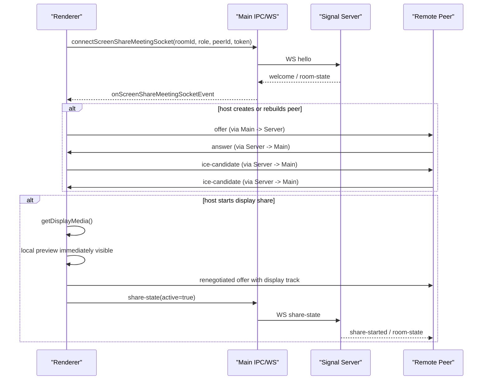

# electron-playground

An Electron application with React

## Recommended IDE Setup

- [VSCode](https://code.visualstudio.com/) + [ESLint](https://marketplace.visualstudio.com/items?itemName=dbaeumer.vscode-eslint) + [Prettier](https://marketplace.visualstudio.com/items?itemName=esbenp.prettier-vscode)

## Project Setup

### Install

```bash
$ npm install
```

### Development

```bash
$ npm run dev
```

### Build

```bash
# For windows
$ npm run build:win

# For macOS
$ npm run build:mac

# For Linux
$ npm run build:linux
```

## 会议视频共享与信令交换流程

### 架构边界

当前会议链路分三层，各自职责固定：

1. `main`  
   持有房间列表 WS 和会议信令 WS，负责窗口管理和 IPC 转发。  
   `main` 不持有 `RTCPeerConnection`、`MediaStream`、`RTCDataChannel`。

2. `renderer`  
   持有 `RTCPeerConnection`、麦克风流、屏幕共享流、远端预览流、聊天 `DataChannel`。  
   所有 WebRTC 媒体对象都在 renderer 内部。

3. `server/screenShareServer.js`  
   只负责房间状态和信令路由，不做媒体转发。  
   音视频和聊天内容走 WebRTC，服务端只转发控制消息。

### 拓扑

当前不是 mesh，也不是 SFU，而是主持人为中心的星型拓扑：

- 主持人 `<->` 每个观众各有一条 `RTCPeerConnection`
- 主持人负责把自己的音频和屏幕共享发送给每个观众
- 聊天 `DataChannel` 也挂在这条 host-viewer 连接上
- 服务端只负责：
  - 房间准入
  - `offer / answer / ice-candidate / renegotiate-request`
  - `share-state / audio-state / leave`

### 总流程



### 1. 入会与握手

#### 创建房间

1. 主界面调用 `createScreenShareRoom`
2. 主进程调用 `createRoomLocal`
3. 服务端生成：
   - `roomId`
   - 主持人固定 `peerId = host`
   - 对应 `token`
   - `wsUrl`
4. 主界面打开会议窗口，并把 `roomId / role / peerId / token / wsUrl` 传进去

#### 加入房间

1. 观众调用 `joinScreenShareRoom`
2. 服务端为观众分配：
   - `peerId = viewer-*`
   - `token`
3. 会议窗口收到这些参数后开始连会议信令 WS

#### `hello -> welcome`

1. renderer 调 `connectScreenShareMeetingSocket`
2. main 建立会议信令 WS
3. WS open 后发送：

```json
{
  "type": "hello",
  "roomId": "...",
  "role": "host|viewer",
  "peerId": "...",
  "token": "..."
}
```

4. 服务端校验 token 后返回 `welcome`
5. `welcome` 中带：
   - 当前房间快照 `room`
   - 当前角色 `role`
   - 当前 `peerId`
   - 如果当前是 host，还会带在线观众列表 `viewerPeerIds`

`welcome` 的作用不是媒体协商本身，而是确认：

- 这条信令连接已经绑定到哪个房间
- 当前是谁
- 房间里已经有哪些对端需要建连接

### 2. Host 与 Viewer 的 WebRTC 交换

#### Host 何时创建 PeerConnection

主持人会在两种场景下创建或重建 `RTCPeerConnection`：

1. 收到 `welcome`，发现已有在线 `viewerPeerIds`
2. 收到服务端转发的 `peer-join`

#### Offer 流程

对每个观众，主持人都会：

1. 创建 `RTCPeerConnection`
2. 创建聊天 `DataChannel`
3. 把本地音频轨道加进去
4. 如果此时已经在共享桌面，再把 display video track 也加进去
5. `createOffer()`
6. `setLocalDescription(offer)`
7. 通过信令发送：

```json
{
  "type": "offer",
  "targetPeerId": "viewer-*",
  "payload": "RTCSessionDescriptionInit"
}
```

#### Answer 流程

观众收到 `offer` 后：

1. 创建自己的 `RTCPeerConnection`
2. `setRemoteDescription(offer)`
3. `createAnswer()`
4. `setLocalDescription(answer)`
5. 通过信令发回：

```json
{
  "type": "answer",
  "targetPeerId": "host",
  "payload": "RTCSessionDescriptionInit"
}
```

主持人收到 `answer` 后，再对对应 peer 执行 `setRemoteDescription(answer)`。

#### ICE 流程

双方在各自 `onicecandidate` 时都通过 WS 发：

```json
{
  "type": "ice-candidate",
  "targetPeerId": "...",
  "payload": "RTCIceCandidateInit"
}
```

服务端只按 `targetPeerId` 转发，不解析候选内容。  
接收方收到后执行 `addIceCandidate(...)`。

### 3. 开始屏幕共享时到底发生了什么

#### 本地先显示，再同步远端

点击“开始共享”后，主持人侧顺序是：

1. 通过 `setScreenShareSource(sourceId)` 把偏好共享源写到主进程
2. 调 `getDisplayMedia({ video: true, audio: false })`
3. 浏览器拿到 `displayStream`
4. renderer 立刻：
   - 保存 `displayStreamRef`
   - 同步 `localPreviewStream`
   - 更新 `shareState = sharing`
   - 本地画面立即显示

这里刻意先保证“本地预览成功”，再做远端同步。  
原因是本地共享成功和网络重协商成功不是同一件事，不能绑死。

#### 远端为什么能看到共享画面

本地拿到 display track 后，host 会重建到每个 viewer 的 peer connection：

1. 关闭旧的 host->viewer peer
2. 新建 peer
3. 把音频轨道重新加进去
4. 把 display video track 加进去
5. 重新发 `offer`

也就是说当前实现不是对原连接做复杂的 `replaceTrack/transceiver` 控制，而是直接重建 host->viewer 连接，让轨道集合保持简单和一致。

#### `share-state`

重协商之外，host 还会通过信令发：

```json
{
  "type": "share-state",
  "active": true
}
```

服务端更新房间状态后，会广播：

- `share-started`
- 新的 `room-state`

这两条的作用是：

- 让 viewer UI 及时切到“正在共享”
- 让主界面房间卡片上的共享状态同步更新

### 4. 停止共享

停止共享时，host 顺序相反：

1. 发 `share-state(active=false)`
2. 停掉本地 display track
3. 清空本地预览
4. 重建 host->viewer 连接，只保留音频轨道

这样 viewer 会回到纯语音模式，服务端也会广播：

- `share-stopped`
- 新的 `room-state`

### 5. 麦克风为什么也会触发重协商

当前默认静音入会。  
首次开麦时，renderer 会：

1. `getUserMedia({ audio: true })`
2. 保存本地 microphone stream
3. 发 `audio-state(active=true)`

如果此时会议已连通：

- host 会重建到所有 viewer 的 peer connection
- viewer 会发 `renegotiate-request` 给 host，由 host 重建对应连接

原因很直接：  
这套实现里 host/viewer 的轨道集合变化统一通过“重建连接”处理，而不是在旧连接上堆更多条件分支。

### 6. 聊天为什么不走 WS

聊天消息不走服务端广播，走 `RTCDataChannel`：

- host 为每个 viewer 创建 `meeting-chat` data channel
- viewer 通过 `ondatachannel` 接入
- 文本和图片都走 DataChannel
- 图片消息过大时会按 chunk 分片发送

但房间控制消息仍然走 WS：

- `hello`
- `offer`
- `answer`
- `ice-candidate`
- `renegotiate-request`
- `share-state`
- `audio-state`
- `leave`

### 7. 关闭会议与离会

#### 主持人

主持人的：

- 离开会议
- 结束会议
- 直接关闭会议窗口

最终效果都一样：

1. main 断开会议信令 socket，并带 `leave`
2. 服务端关闭整个房间
3. 服务端广播 `room-closed`
4. 其他参会者窗口退出
5. 主界面房间列表通过房间列表 WS 更新

#### 观众

观众离会时：

1. 只移除自己
2. 服务端广播 `peer-leave` / `room-state`
3. 若房间中已无人在线，服务端直接关闭房间

### 8. 为什么这套实现要这样分层

当前做法的核心原则是：

1. WS 负责控制，不负责媒体  
2. WebRTC 负责音频、屏幕画面、聊天数据  
3. main 持有应用级连接  
4. renderer 持有浏览器媒体对象

这样做的直接收益是：

- 不把 `MediaStream` 和 `RTCPeerConnection` 硬搬进主进程
- 不让多个窗口重复建立相同的房间列表连接
- 不让聊天/共享/麦克风逻辑和窗口管理混在同一层

## 录屏封面与播放问题复盘

### 现象

1. 录制视频文件和封面文件都已保存，但应用内列表不显示封面。
2. 点击“打开文件”后，新窗口无法正常播放视频。

### 排查结论

1. 不是磁盘读写权限问题。  
   调试接口返回 `fileExists: true`、`posterExists: true`，说明文件实际存在。
2. 主要问题在渲染层媒体访问链路：  
   直接用 `file://` 或不完整的自定义协议实现，容易在 Electron + CSP + `<video>` 场景下出现加载失败。
3. `<video>` 播放还依赖 HTTP Range 语义。  
   如果自定义协议没有正确返回 `206 Partial Content` / `Content-Range`，播放器可能无法工作。

### 最终方案

1. 保存目录统一为 `~/Downloads/Recording`。
2. 封面生成改为主进程 `ffmpeg` 抽帧，策略如下：  
   先尝试 `1.916667s`（第一秒后的第 12 帧），失败回退到 `1s`，再回退到首帧。
3. 列表卡片只使用 `img` 显示封面，不再用 `video` 组件承担封面展示。
4. 主进程注册 `recording://` 自定义协议用于受控访问录屏目录中的媒体资源。  
   协议实现补齐了 Range 支持（`206`、`Content-Range`、`Accept-Ranges`），确保 `<video>` 可正常播放。
5. “打开文件”改为应用内播放器窗口（不是系统浏览器），并设置 `preload="metadata"`，不自动播放。
6. 增加诊断接口 `window.api.debugScreenRecordingAccess()`，用于快速确认：
   - 录屏目录是否正确
   - `ffmpeg` 路径是否可用
   - 视频/封面文件是否存在
   - 返回给前端的媒体 URL 是否正确

### 调试建议

当再次出现“封面显示或播放失败”时，按顺序检查：

1. 在渲染进程控制台执行：

```js
await window.api.debugScreenRecordingAccess()
```

2. 查看主进程日志中是否有：
   - `[recording] poster ... failed`
   - `[recording] media protocol failed`
   - `[recording] player console: ...`

3. 确认关键前置条件：
   - `recordingsDir` 指向 `~/Downloads/Recording`
   - `ffmpegPath` 可执行
   - `fileExists/posterExists` 均为 `true`
## Recording And Cloud Sync Pipeline

### End To End Work Chain

The current recording pipeline is split into three layers:

1. Renderer capture layer  
   `src/renderer/src/hooks/useScreenRecordingController.js`  
   The renderer owns screen permission, `getDisplayMedia`, the single continuous `MediaRecorder`, and periodic `ondataavailable` chunk emission.

2. Main-process persistence and orchestration layer  
   `src/main/recording.js` and the `src/main/recording*.js` modules  
   The main process owns session lifecycle, SQLite persistence, disk writes, local output finalization, cloud sync queue scheduling, and recovery.

3. Cloud sync server layer  
   `server/cloudSyncServer.js`  
   The server accepts upload parts, stores them by `partIndex`, and merges them by byte order after the client completes the session.

### Call Chain

#### Local recording start

1. The renderer calls `window.api.startScreenRecordingSession(...)`.
2. `src/main/recordingHandlers.js` forwards the IPC call into `createRecordingSession(...)`.
3. `src/main/recordingSessions.js` creates a runtime session and opens the first writable target.
4. Session state is persisted into SQLite through `persistRecordingSessionManifest(...)`.

#### Continuous capture and disk writes

1. The renderer creates a single `MediaRecorder`.
2. `MediaRecorder.start(1000)` emits one chunk roughly every second.
3. Each chunk is sent through `window.api.appendScreenRecordingChunk(...)`.
4. `src/main/recordingSegments.js` parses the payload into a `Buffer`.
5. The buffer is appended to disk immediately.

#### Local-only recording

When cloud sync is disabled:

- The main process writes directly into the current local segment file.
- Stop recording finalizes the last segment.
- If there is more than one local segment, the main process merges them into the final local video.
- After the final output is ready, the session directory is deleted.

#### Cloud-sync recording

When cloud sync is enabled:

- The main process writes every chunk into one continuous local capture file: `capture.<ext>.part`
- The same chunk is also written into the current transport part file: `part-0001.bin`, `part-0002.bin`, and so on
- Transport parts are cut by size threshold, not by a timed recorder restart
- Once a part reaches the configured threshold, it is sealed and queued for upload
- The continuous local capture file stays open until the user stops recording
- Stop recording closes the continuous capture file and renames it into the final local video

### Disk Persistence Strategy

#### Local output strategy

- A recording session always has a dedicated session directory under `~/Downloads/Recording/sessions/<sessionId>`
- Local metadata is persisted in SQLite, not in `manifest.json`
- During recording, chunks are written immediately to disk so the renderer does not keep the full recording in memory

#### Cloud-sync strategy

- The local source of truth for playback is the continuous capture file
- Upload parts are transport artifacts only
- Upload parts are stored in the session directory until the server reports `merged`
- After cloud merge succeeds, the session directory is cleaned

### Upload Strategy

The upload model is `parts`, not media segments.

- A part is a transport unit for retry and resume
- A part is not assumed to be an independently playable video file
- The client uploads each completed part to `PUT /api/cloud-sync/sessions/:sessionId/parts/:partIndex`
- The client later calls `POST /api/cloud-sync/sessions/:sessionId/complete`
- The server merges uploaded parts by byte order, not by ffmpeg media concat

### Why This Design

This design solves three problems from the earlier implementation:

1. It avoids recorder `stop/start` gaps that shortened the final duration.
2. It avoids keeping the full recording in renderer memory.
3. It separates local playback correctness from cloud transport batching.

### Main Modules

- `src/main/recording.js`  
  Composition root for the recording system.
- `src/main/recordingHandlers.js`  
  IPC registration layer.
- `src/main/recordingSessions.js`  
  Recording session lifecycle orchestration.
- `src/main/recordingSegments.js`  
  Chunk append, part cut, stream finalization.
- `src/main/recordingRecovery.js`  
  Local merge, cleanup, and recovery flows.
- `src/main/cloudSyncRuntime.js`  
  Background upload, retry, complete, and status polling.
- `src/main/recordingSessionState.js`  
  Runtime summary building and SQLite sync orchestration.
- `src/main/recordingDbCore.js`  
  SQLite connection and transaction primitives.
- `src/main/recordingDb.js`  
  Recording and cloud-sync persistence access layer.
- `server/cloudSyncServer.js`  
  Cloud sync HTTP server and remote part merge implementation.
